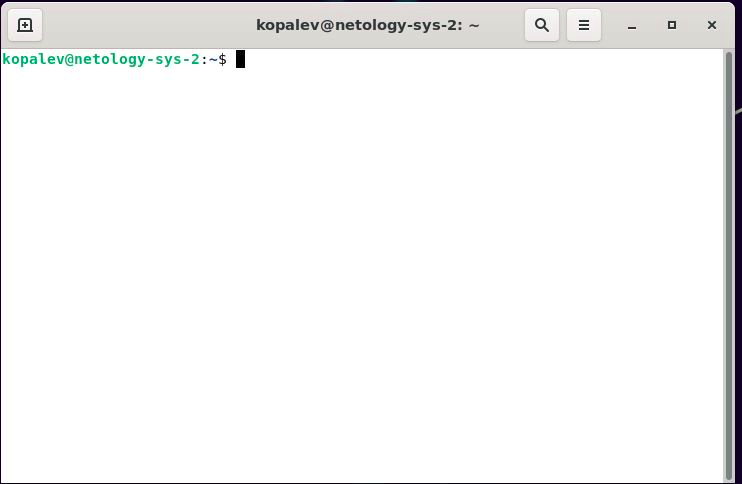
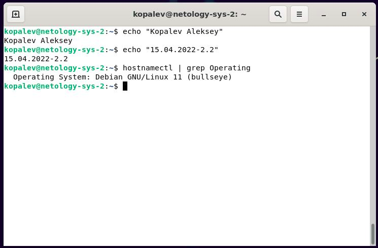
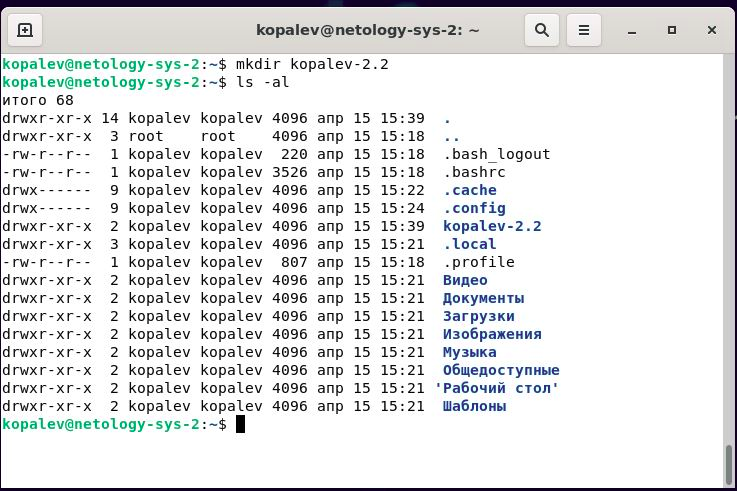
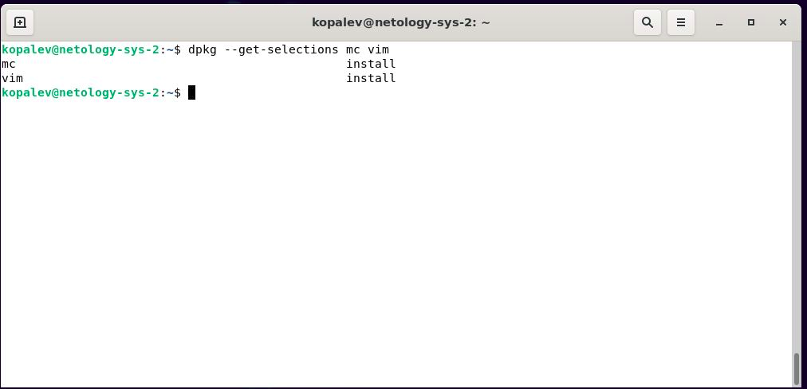

### Задание 1

### Задание 2

### Задание 3

### Задание 4
<code>mv kopalev-2.2/ kopalev-2.2-22-04-15; touch kopalev-2.2-22-04-15/concept.1; hostnamectl | grep Operating > kopalev-2.2-22-04-15/concept.1; echo "Aleksey Kopelev" >> kopalev-2.2-22-04-15/concept.1; echo "2.2" >> kopalev-2.2-22-04-15/concept.1; cat kopalev-2.2-22-04-15/concept.1 | grep Aleksey</code>

### Задание 5
<code>sudo ln -s /home/kopalev/kopalev-2.2-22-04-15/ /opt</code>

<code>cp /opt/kopalev-2.2-22-04-15/concept.1 /opt/kopalev-2.2-22-04-15/concept.1.old</code>

<code>rm /opt/kopalev-2.2-22-04-15/concept.1</code>

### Задание 6
<code>sudo apt update</code>

<code>sudo apt upgrade</code>

<code>sudo apt install mc vim</code>

### Задание 7
В процессе выполнения