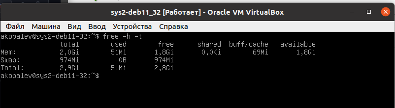
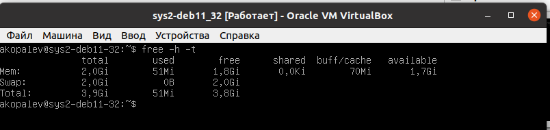
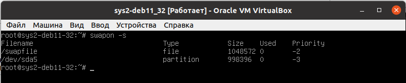
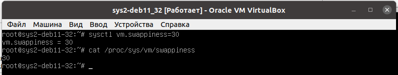
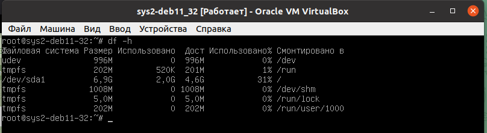
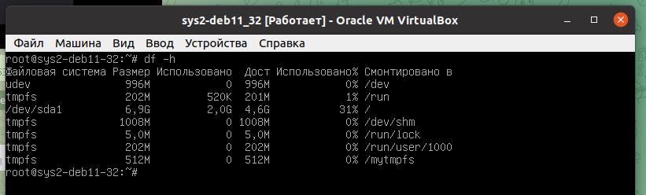

### Задание 1
- При переходе компьютера в режим сна информация в оперативной памяти сохраняется, на модули памяти сохраняется подача электроэнергии 
- при переходе компьютера в режим гипернации, все содержимое оперативной памяти сохраняется на жесткий диск, подача электроэнергии на модули памяти останавливается

### Задание 2
Это программа vmstat, вот вырезка из man

- si: Amount of memory swapped in from disk (/s). (Объем памяти, загруженной с диска в секунду)
- so: Amount of memory swapped to disk (/s). (Объем памяти, загруженной на диск в секунду)

### Задание 3
У меня установлена Ubuntu 20.04

- `lscpu | grep "Архитектура"`
				
	Архитектура: x86_64
	
- `lscpu | grep "Имя модели"`

	Имя модели: AMD Ryzen 5 2500U with Radeon Vega Mobile Gfx
- `cat /proc/meminfo | grep Inactive:`

	Inactive:        3945844 kB

### Задание 4

### Задание 5
tmpfs - это файловая система в оперативной памяти, все файлы созданные в этой ФС - временные, и существуют в ней до перезагрузки системы.

