### Задание 1
Производительность дисковой подсистемы увеличивают RAID 0, RAID 50, в меньшей степени RAID 60 и RAID 10.

RAID 1 увеличивает скорость чтения дисковой подсистемы, т.к. чтение данных может производится одновременно с нескольких устройств

### Задание 2
Так как в Linux параметр load average учитывает не только процессы в состоянии выполнения, но и в состоянии непрерываемого сна, которые могут ожидать в том числе и операций ввода\вывода с дисковой подсистемы, то количество операций ввода-вывода (производительность дисковой подсистемы) может влиять на значения параметра 
load average

### Задание 3
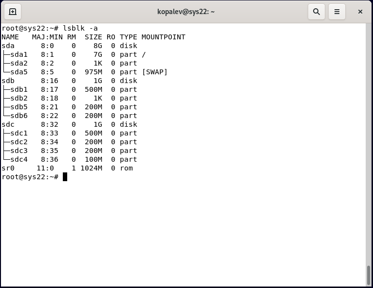

### Задание 4
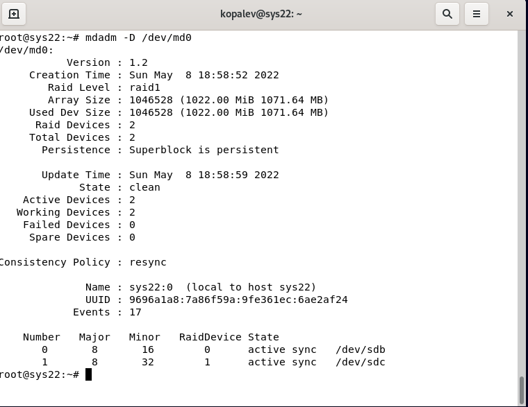

### Задание 5
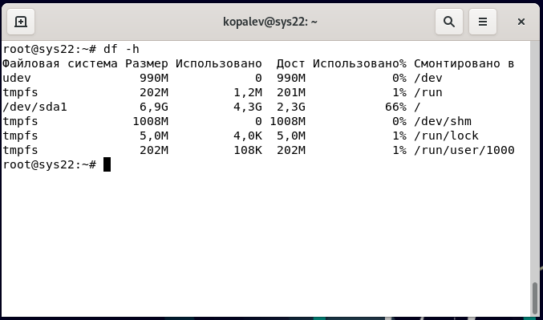

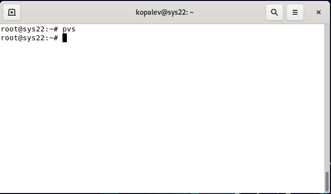

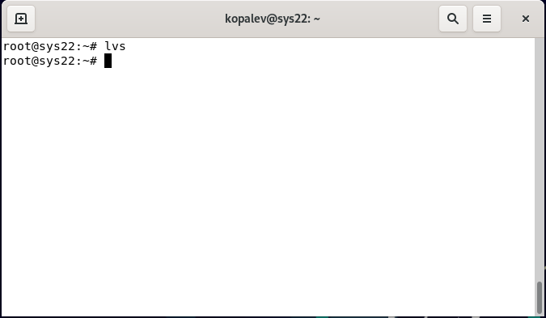

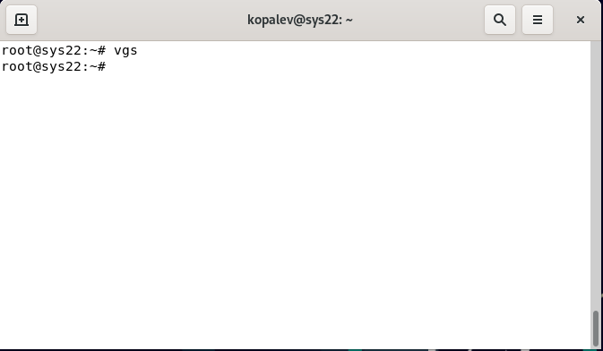

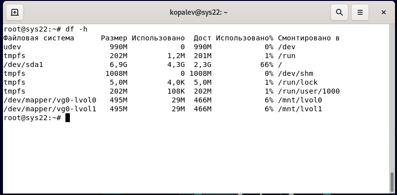

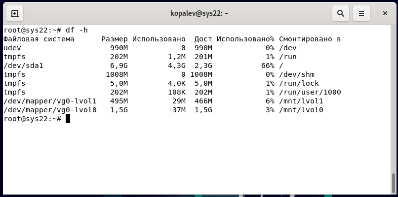

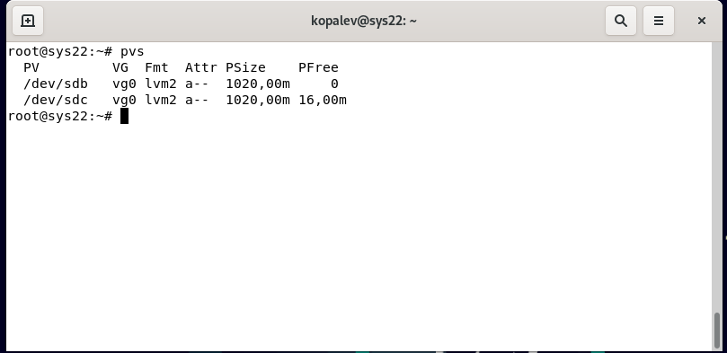

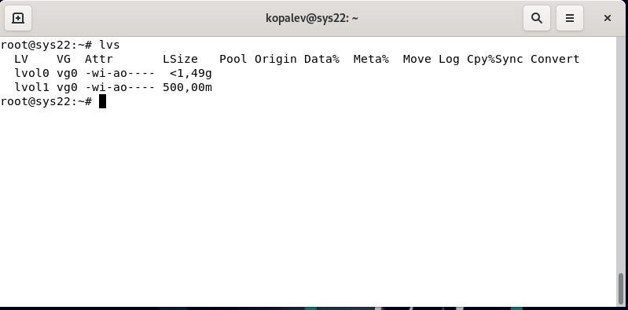

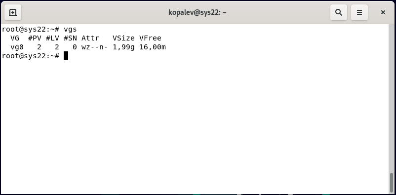