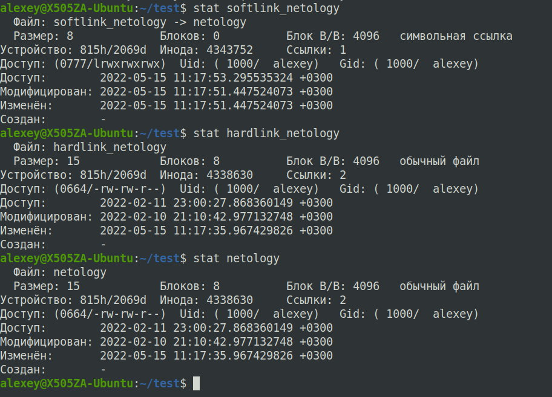
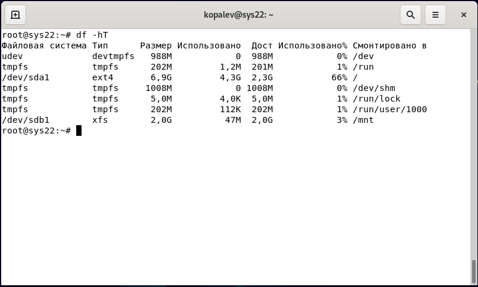
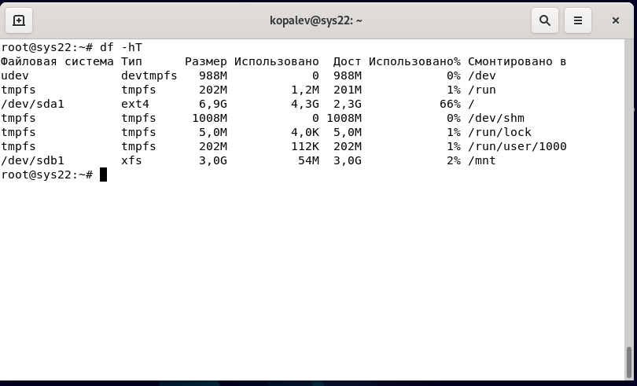
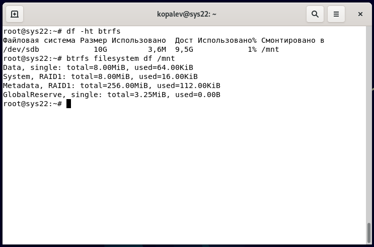

### Задание 1
Hardlink по сути является еще одним 
обозначением файла (или названием), т.к. является указателем на inode оригинального файла. Hardlink не занимает места на устройстве, так как является не отдельным файлом, а указателем на туже inode что и оригинальный файл. Hardlink не может быть создан для каталога. При удалении hardlink уменьшается счетчик ссылок на файл (конкретный inode), когда этот счетчик будет равен 0, удалится файл (сама информация) с устройства.

### Задание 2
Ошибка возникнет при попытки создания директории netology, после создания файла netology в той же директории. Будет выдана ошибка, что каталог создать нельзя, так как файл уже существует в этой директории. С точки зрения Linux и файл и директория обе являются файлами, только разных типов, поэтому система не дает создать файл с одинаковым именем.

### Задание 3
1. Например командой `df -i | grep /dev/sda2`
		
	/dev/sda2      28286976         36647  28250329             1% /media/alexey/MyFiles
где 28286976 - всего inode, 36647 - использовано, 28250329 - свободно

2. В файловых системах с динамическим количеством inode, например - jfs, xfs, btrfs, zfs

### Задание 4

### Задание 5
Для работы с данными будет доступно 9,5G, метаданные займут по 256М на каждом диске.
Так происходит потому, что создание btrfs на нескольких дисках сразу по умолчанию применит профиль «RAID0» к пользовательским данным, а к метаданным — «RAID1».

