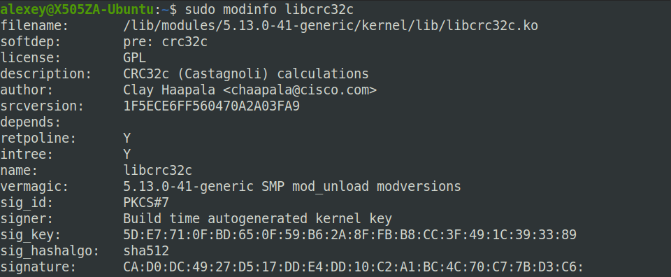
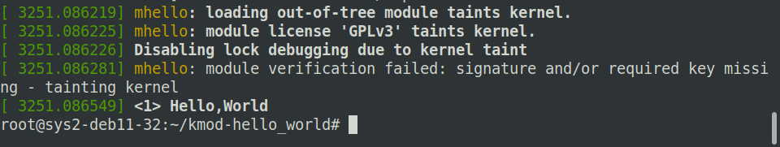

### Задание 1
Выполнение процесса переходит в режим ядра при двух событиях:
- выполнение системного вызов (обращение прикладной программы к ядру ОС для выполнения какой-либо операции)
- аппаратное прерывание (сигнал от оборудования об окончании какого-либо действия или о возникновении ошибки)

### Задание 2

### Задание 3
`chdir("/tmp")`

### Задание 4

