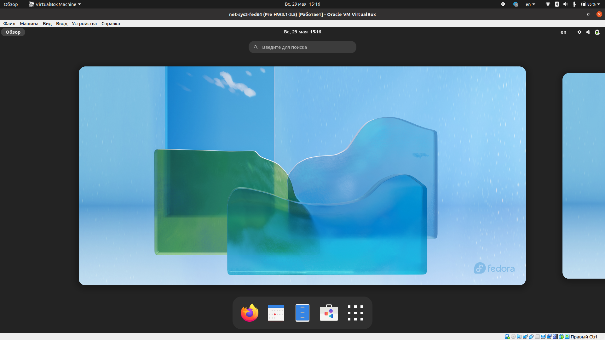
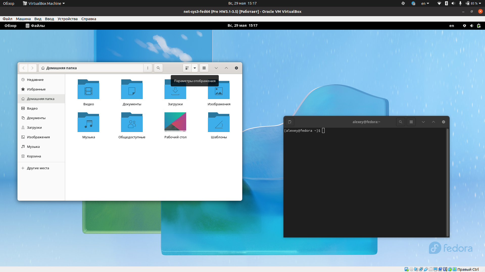
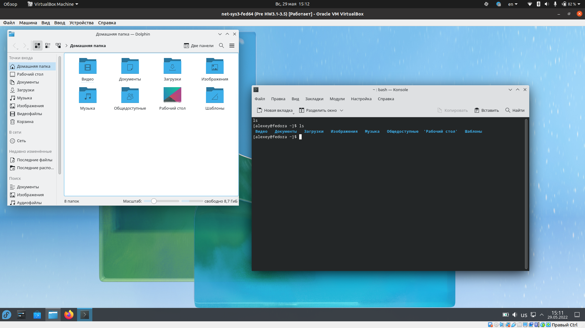

### Задание 1
Дистрибутив – это форма распространения системного программного обеспечения. В состав дистрибутива могут входить:

* ядро ОС;
* система инициализации;
* предустановленный и доступный набор ПО;
* графическое окружение;
* менеджер пакетов;
* исправления и другое ПО от разработчиков дистрибутива.

### Задание 2
Танненбаум является автором ОС Minix (на основе микроядерной архитектуры) и автором книг по компьютерным наукам (Операционные системы: разработка и реализация и др.). Эта книга и ОС вдохновили Линуса Торвальдса на создание ядра ОС Linux (на основе монолитной архитектуры)

### Задание 3
#### 3.1
`yum info mc | grep Репозиторий`

	Репозиторий  : updates

`apt info mc | grep Sources`

	APT-Sources: http://ru.archive.ubuntu.com/ubuntu focal/universe amd64 Packages
#### 3.2
`yum repolist`

`cat /etc/apt/sources.list`

Так же в DEB-based можно посмотреть дополнительные репозитории командой `cat /etc/apt/sources.list.d/*`
#### 3.3
Информацию о системе можно получить несколькими командами. В  DEB-base дистрибутивах

`uname -a`

		Linux X505ZA-Ubuntu 5.13.0-44-generic #49~20.04.1-Ubuntu SMP Wed May 18 18:44:28 UTC 2022 x86_64 x86_64 x86_64 GNU/Linux

`hostnamectl`

	Static hostname: X505ZA-Ubuntu
	Icon name: computer-laptop
	Chassis: laptop
	Machine ID: c9e609a5b5ec45f8a829a70747933238
	Boot ID: d3367fe3e5494de79125d9927e6072be
	Operating System: Ubuntu 20.04.4 LTS
	Kernel: Linux 5.13.0-44-generic
	Architecture: x86-64

#### 3.4
Систему инициализации можно узнать командой `ls -l /usr/sbin/init`

Для моей системы вывод такой

	lrwxrwxrwx 1 root root 20 апр 21 15:54 /usr/sbin/init -> /lib/systemd/systemd
Значит моя система использует систему инициализации - systemd

Так же систему инициализации можно понять изучив процесс запущенный под PID 1. Это моэно сделать например изучив вывод команды `top` или `sudo ls -l /proc/1/exe`

#### 3.5
Старая графическая оболочка (Gnome) 

Новая оболочка (KDE Plasma)

