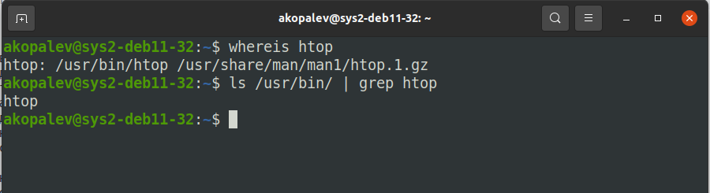
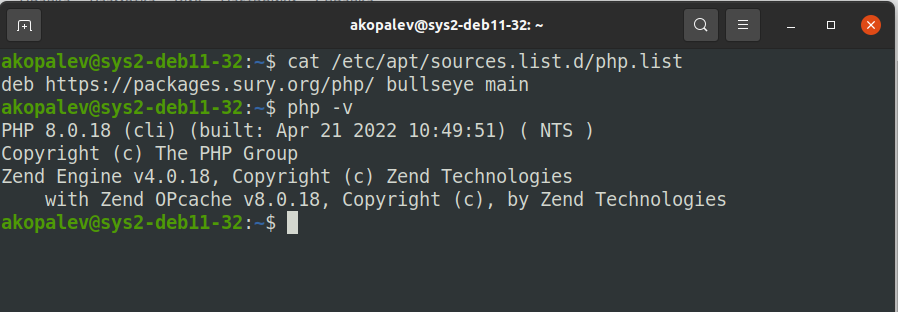
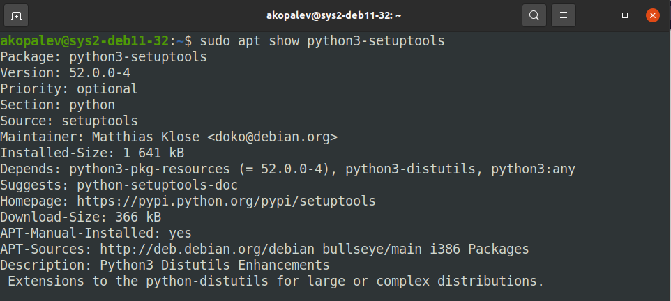
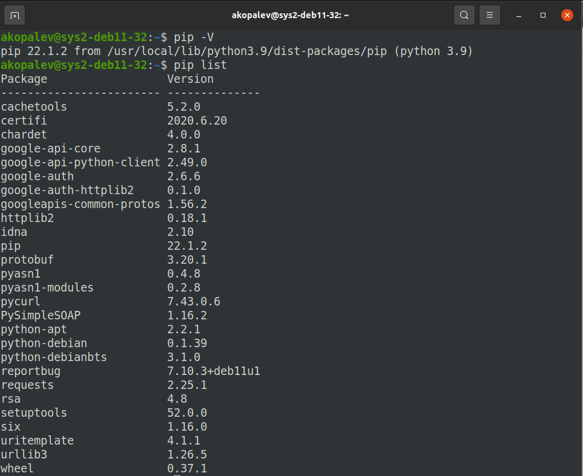

### Кейс 1
Основным достоинством работы с пакетными менеджерома и репозиториями, я считаю, является просто распространения и установки ПО. Так же к плюсам можно отнести, то что через пакетный менеджер можно управлять приложениями (удалять и обновлять), а так же разрешать все зависимости при установке ПО.

К минусам можно отнести, необходимость поддерживать репозитории в актуальном состоянии. Разработчикам нужно постоянно упаковывать новые версии своих приложений в пакеты и публиковать их в репозиториях.

### Кейс 2
Добавить в систему gpg-ключ от стороннего репозитория и добавить адрес этого репозитория в source.list

Опасность распространения ПО таким способом в том что, через такие репозитории можно распространять вирусы и др. вредоносное ПО

Что бы этого избежать, можно собирать пакеты самому из исходников ПО

### Кейс 3
`sudo apt show htop && sudo apt install -y htop`

Зависимости 

	Depends: libc6 (>= 2.29), libncursesw6 (>= 6), libnl-3-200 (>= 3.2.7), libnl-genl-3-200 (>= 3.2.7), libtinfo6 (>= 6)

### Кейс 4

### Кейс 5

### Кейс 6
Так же следующие утилиты для управления пакетами:

- DPKG - в DEB-base системах
- APTITUDE - может использоваться и DEB-base системах и в RPM-base
- Synaptic - в DEB-base системах
- Gnome Software - может использоваться и DEB-base системах и в RPM-base
- Synaptic - в DEB-base системах
- APPGRID - в DEB-base системах
- DNF - в RPM-base системах
- PACKMAN - менеджер пакетов для Arch Linux и дистрибутивах основанных на нем
- Zypper - менеджер пакетов для OpenSUSE и SUSE Linux
- Portage - пакетный менеджер Gentoo
- Snap - может использоваться и DEB-base системах и в RPM-base
- Flatpack - может использоваться и DEB-base системах и в RPM-base

### Кейс 7