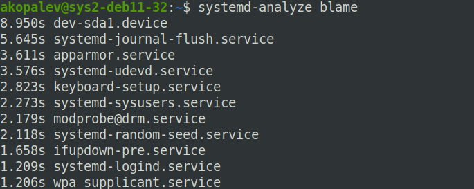
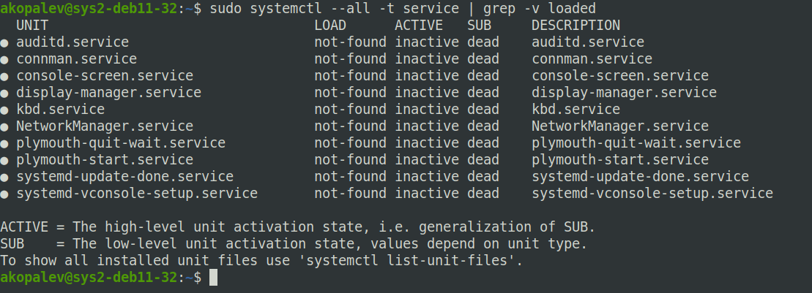
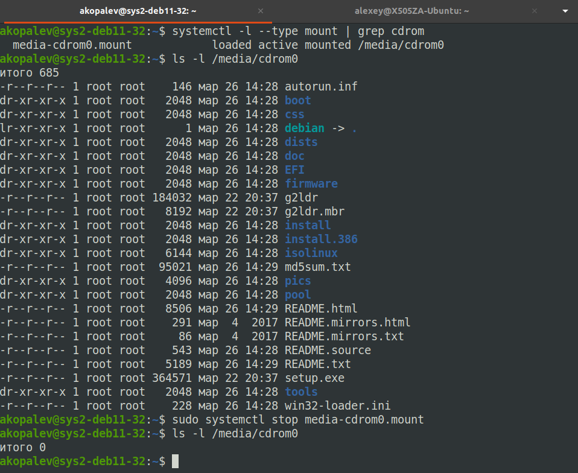

### Задание 1
Более одной секунды загружаются следующие модули

	8.950s dev-sda1.device
	5.645s systemd-journal-flush.service
	3.611s apparmor.service
	3.576s systemd-udevd.service
	2.823s keyboard-setup.service
	2.273s systemd-sysusers.service
	2.179s modprobe@drm.service
	2.118s systemd-random-seed.service
	1.658s ifupdown-pre.service
	1.209s systemd-logind.service
	1.206s wpa_supplicant.service

### Задание 2

`sudo journalctl -k -p 3 -S yesterday -U now`

### Задание 3

Эта утилита предназначена для управления сессиями пользователей. С помощью нее можно получить информацию о пользователях, которые вошли в систему, о начале сессии пользователя, его процессах и т.д. Через эту так же можно управлять сессиями пользователей.

Команда `loginctl user-status` выводит краткую информацию о пользователе, который вызвал командую. Так же в выводе команды присутствуют самые последние данные из журнала.

### Задание 4

Да, службы которые не смогли запуститься в системе есть. Проверил это командой `sudo systemctl --all -t service | grep -v loaded`

### Задание 5

Да, с помощью systemd можно отмонтировать раздел/устройство. В systemd можно создать специальные unit файлы для монтирования файловых систем и разделов типа .mount. Далее можно смонтировать устройство или раздел командой 

`sudo systemctl start media-cdrom0.mount` 

или размонтировать командой 

`sudo systemctl stop media-cdrom0.mount`

