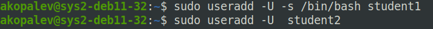
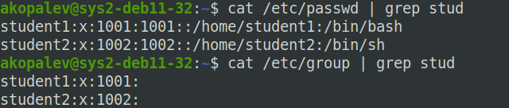
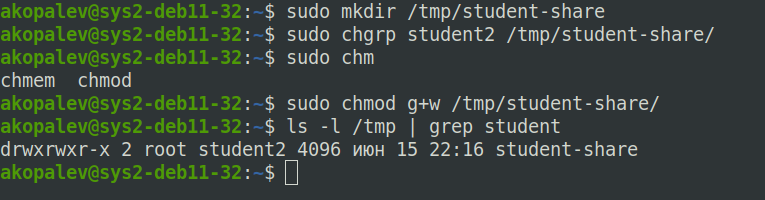
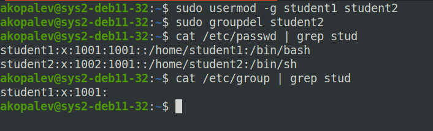
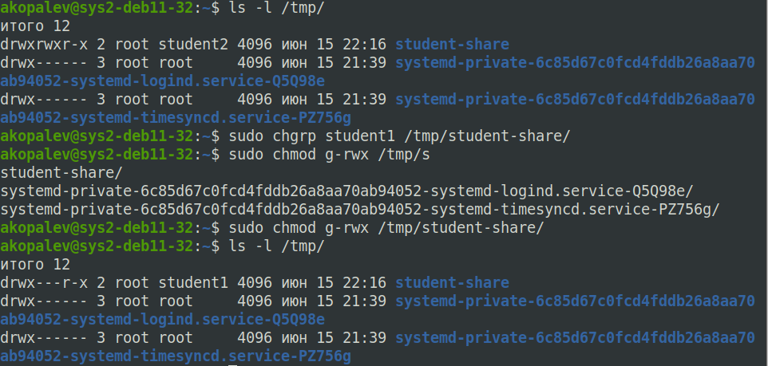
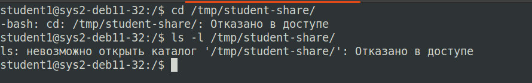
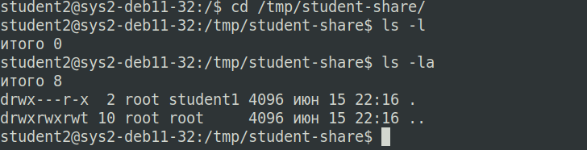

### Задание 1

### Задание 2

### Задание 3

	ls -l /etc/ |grep passwd
	-rw-r--r-- 1 root root    1586 июн 15 22:03 passwd

Файл passwd доступен на чтение и запись только пользователю root, а остальным доступен только для чтения. В этом файле находится общая информация о пользователях, такая как имя пользователя, его UID, домашний каталог и др.

	ls -l /etc/ |grep shadow
	-rw-r----- 1 root shadow   900 июн 15 22:03 shadow

Файл shadow доступен на чтение и запись только пользователю root, а остальным не доступен, так как в нем находится зашифрованная форма паролей пользователей.

Думаю что,  два файла нужны что бы ограничить доступ к информации о паролях пользователей

### Задание 4

### Задание 5

