### Задание 1
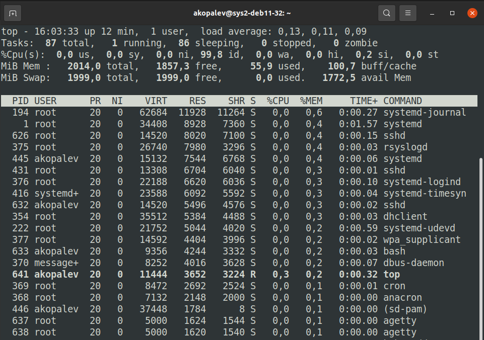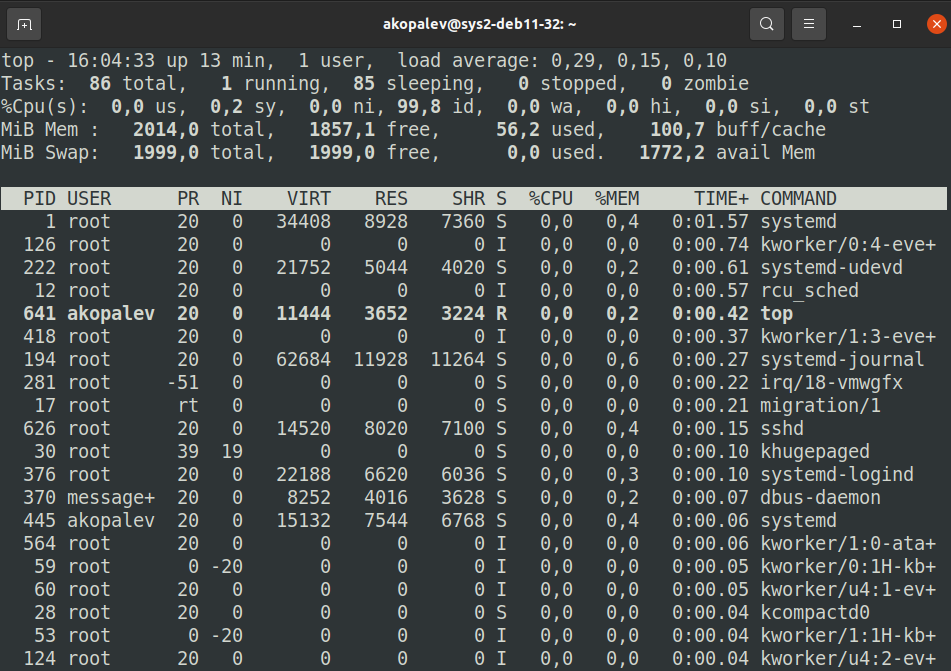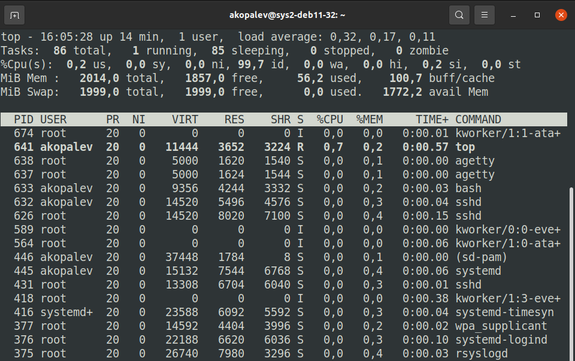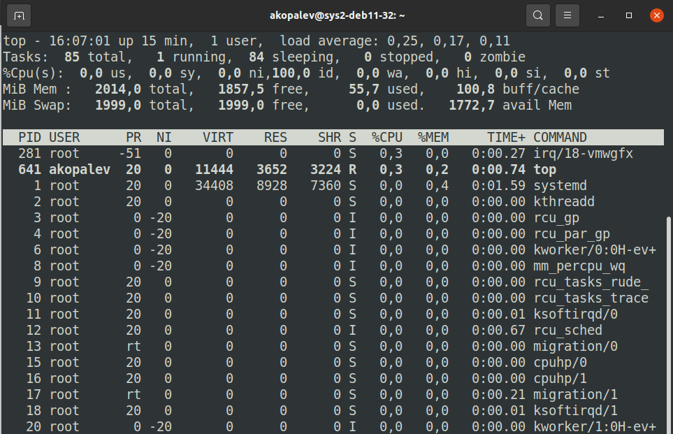

### Задание 2
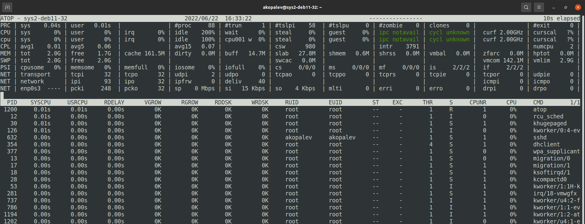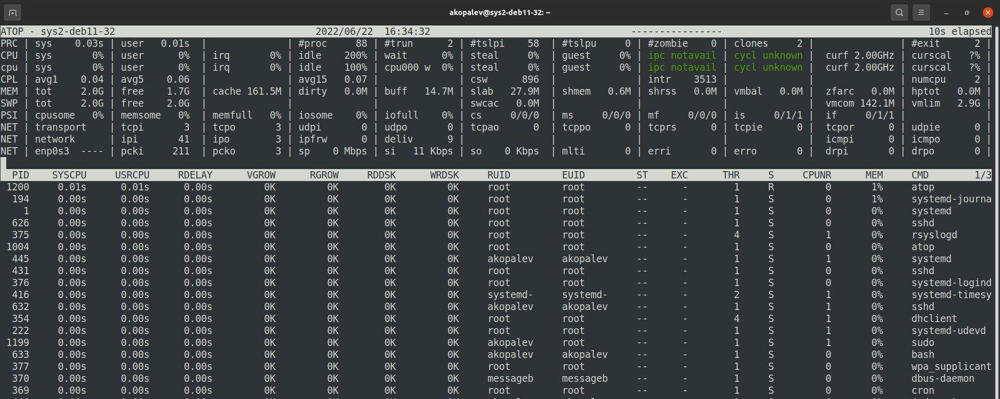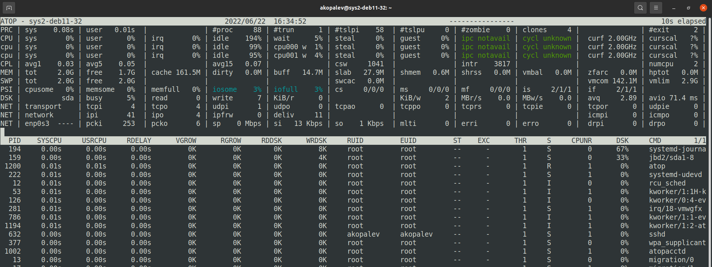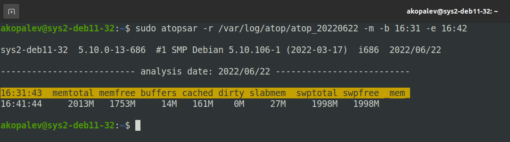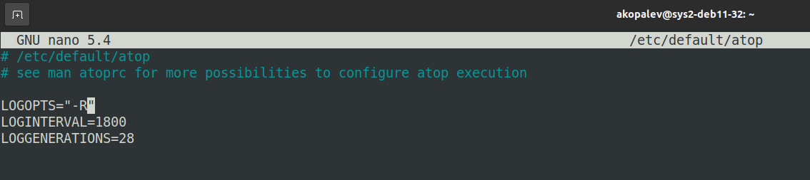

### Задание 3
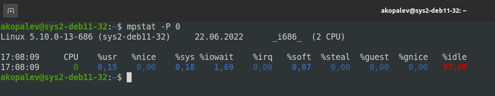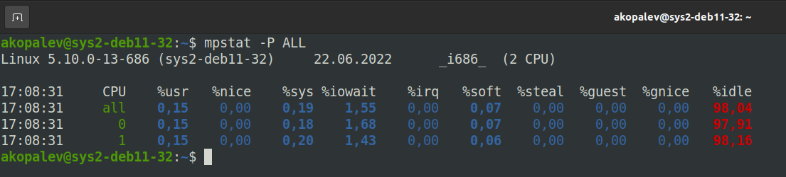

### Задание 4
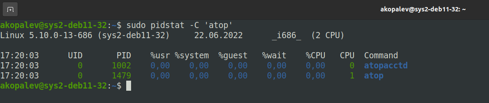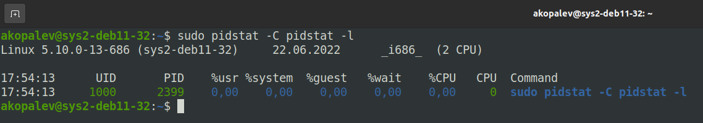

### Задание 5
Из концепции Linux - все есть файл, в папке /proc хранится информация о системе и процессах в виде директорий и файлов. При запуске процесса в папке /proc создается директория с названием PID процесса. Из этих файлов 
можно получить информацию о работе системы в текущий момент времени.

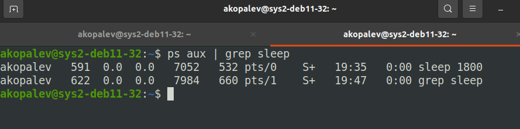

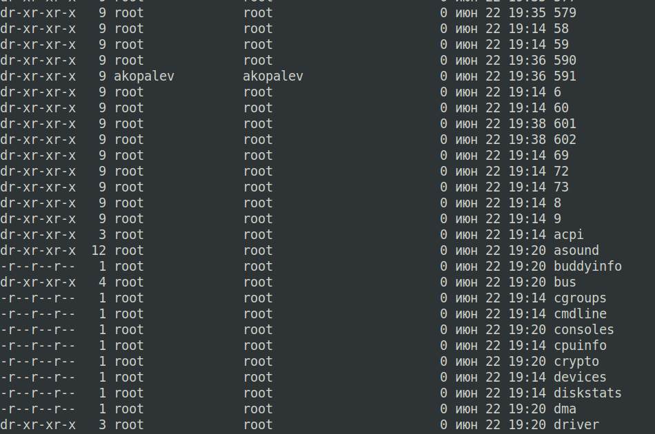

У файлов и директорий, которые связаны с самой системой время создания соответсвует времени загрузки системы. Время создания директорий для процессов, соответствует времени запуска процесса.