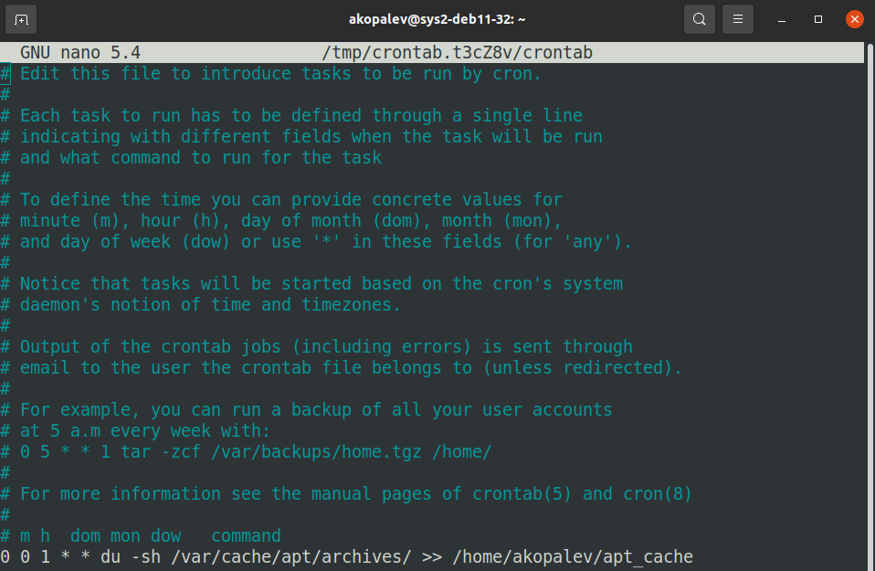
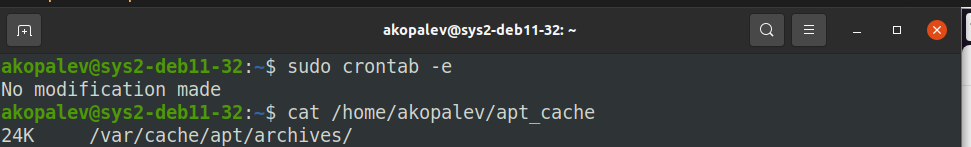
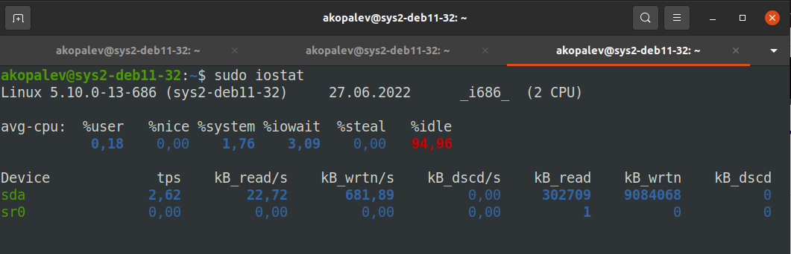
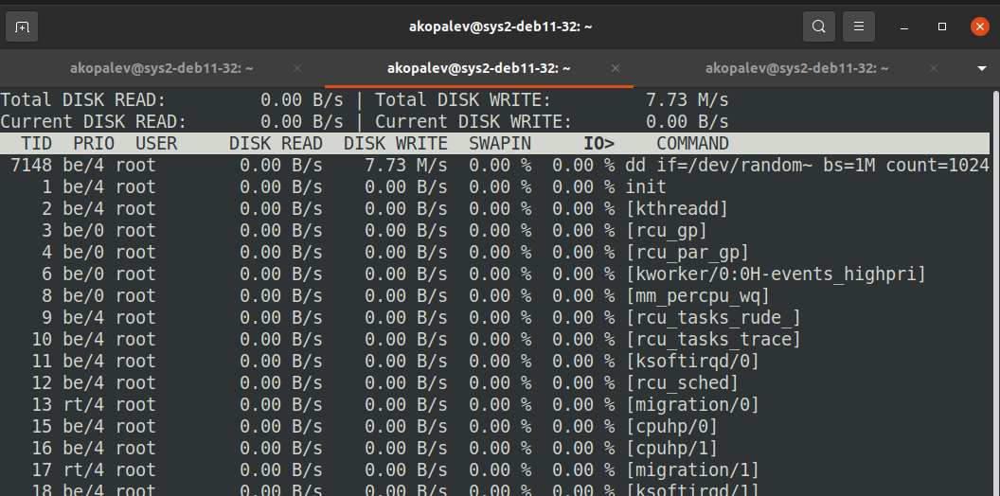
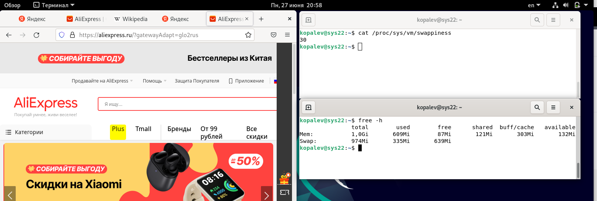
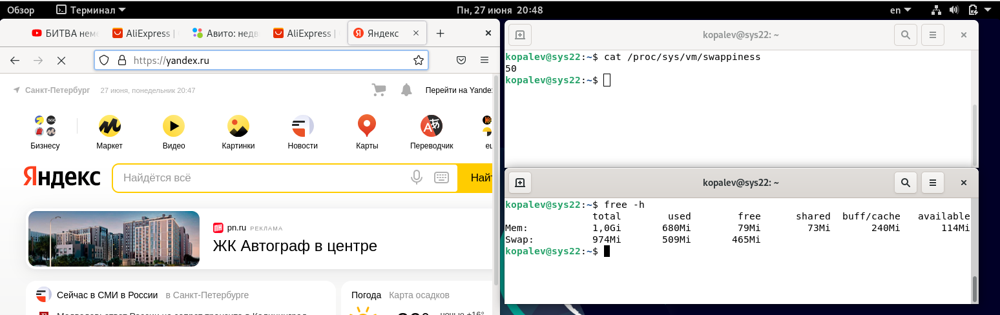
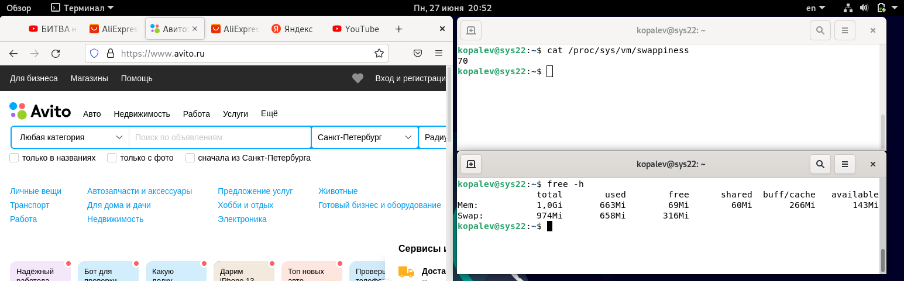

### Задание 1
`0 0 1 * * du -sh /var/cache/apt/archives/ >> /home/akopalev/apt_cache`

### Задание 2

На данные команды влияют любые программы, которые выполняют работу с дисковой подсистемой, читают или записываю данные.

### Задание 3

Чем больше процент использования SWAP, тем меньше используется оперативная память, но возрастает нагрузка на диск, где находится SWAP файл или раздел. Так как диск гораздо медленнее оперативной памяти, то система становится менее отзывчивой.
