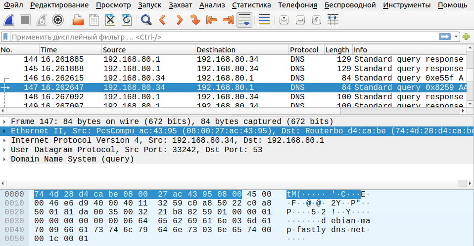

### Задание 1
Данный MAC принадлежит производителю - Apple 

### Задание 2
- В текстовом виде нужно добавить ключи -eA
- В текстовом и шестнадцатеричном ключ -X

### Задание 3
1. Да, можно
2. `sudo ip link set dev enp0s3 address XX:XX:XX:XX:XX:XX`
3. Если на DHCP стоит привязка к MAC-адресу, можно выдать тот же ip-адрес новому клиенты. Так же при помощи смены MAC адреса, можно перехватывать трафик предназначеный другому клиенту. 

### Задание 4
1. Можно избежать динамической установки соответствия IP-MAC, если создать в ARP таблице статическую запись.
2. Плюсы - можно избежать подмены MAC-адреса и быть уверенным что трафик дойдет до нужного адресата.
Минус - нужно будет следить за актуальностью статических записей в таблице и обновлять их в ручную. 

### Задание 5
Все методы обнаружения ошибок основаны на передаче в составе кадра данных служебной избыточной информации, по которой можно судить с некоторой степенью вероятности о достоверности принятых данных. Эту служебную информацию принято называть контрольной суммой

### Задание 6
У сервера обычно гораздо больше сетевых соединений, поэтому соединение должно быть более скоростным и качественным. Так же к проводному соединению сложнее подключиться "физически" для перехвата трафика.

### Задание 7
4 домена коллизий

### Задание 8
3 широковещательных домена

### Задание 9
Ethernet II

Да, можно в полях Src: и Dst:
