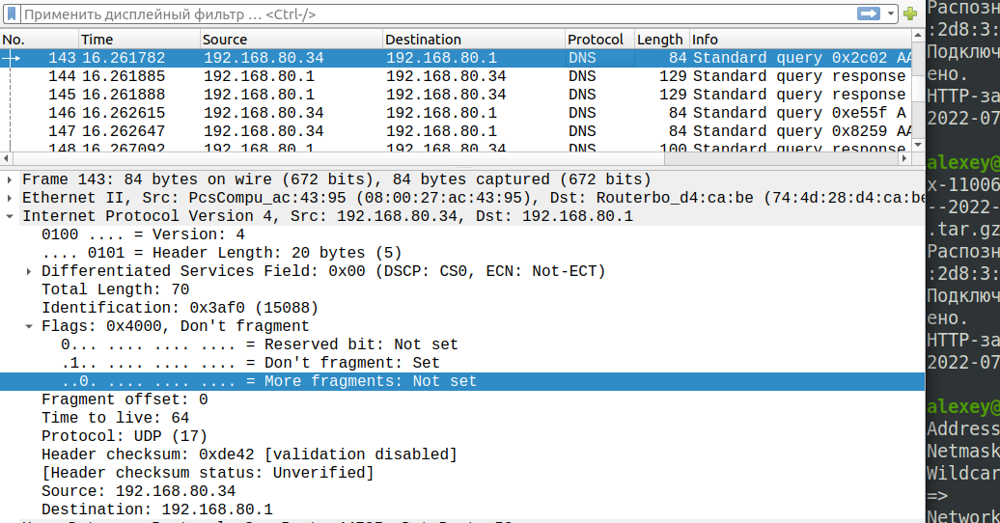

### Задание 1
- Хостам доступно 126 адресов
- 524286 адресов

### Задание 2
В подсети /24 - 256 адресов
В подсети /23 - 512 адресов

### Задание 3
- В подсети 10.0.0.0/8 - 16777214 адресов, ее получится разбить на 128 подсетей по 131070 адресов в каждой
- у каждой такой подсети будет маска /15

### Задание 4

1. 12 хостов - 255.255.255.240 или /28

2. 39 хостов - 255.255.255.192 или /26

3. 2 хоста - 255.255.255.252 или /30

4. 4 хоста - 255.255.255.248 или /29

### Задание 5
Не получится, т. к. обо сети имеют одинаковую адресацию, роутеры будут пытаться отправить пакет в пределах сети 192.168.1.0/24

### Задание 6
- Думаю, что смогут, если на обоих прописан шлюзоз маршрутизатор 192.168.1.1
- Да, сможет, если на роутере прописан маршрут по умолчанию
- Да, сможет, если на роутере прописан маршрут по умолчанию

### Задание 7
Нет, не откроется, так как роутер и компьютер находятся в разных сетях. Что бы открылось надо на сетевом интерфейсе компьютера прописать IP-адрес из сети роутера, например 10.0.0.2/24. Так же можно прописать на сетевом интерфейсе компьютера шлюз по-умолчанию 10.0.0.1

### Задание 8

1. 192.168.1.1
2. слишком большой второй октет
3. 90.90.10.1
4. пропущен последний (четвертый) октет
5. 0.165.14.5
6. 1.1.1.1

### Задание 9

Да установлен флаг, который запрещает фрагментацию пакетов

