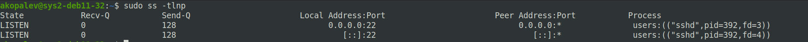

### Задание 1
TCP-сегмент состоит из заголовка и данных, при отправке SYN-запроса данные не отправляются, поэтому длина сегмента будет равна длине заголовка TCP - пять 32-битных слов (20 байт)

### Задание 2
Узел А будет в состоянии - Established

### Задание 3
При штатном режиме работы сети, флаги SYN и FIN не могут быть одновременно установлены в значение 1, так как флаг SYN отвечает за установление соединения,а флаг FIN за его прекращение.

### Задание 4

1. Утилита ss показывает сетевые сокеты, ключ -l выводит сокеты в состоянии listening, но так как UDP-протокол без сохранения состояния соединения, то в списке будут только соединения с состоянием UNCONN и ESTAB. 
2. Нет, не может

### Задание 5

1. Да, может.
2. Это состояние плохое, так как означает что на хосте было открыто и закрыто много соединений, которые ожидают что по этому соединению еще могут прийти данные. Если таких соединений будет больше чем портов, новые соединения не смогут быть открыты.

### Задание 6
Я бы выбрал протокол TCP, так как для сбора логов важно надежность соединения и уверенность в доставке информации 

### Задание 7

1. Прослушиваются 2 порта SSH на протоколах IPv4 и IPv6

2. 

3. `sudo ss -tlnp`