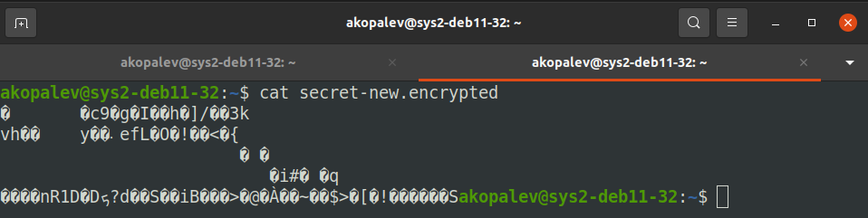
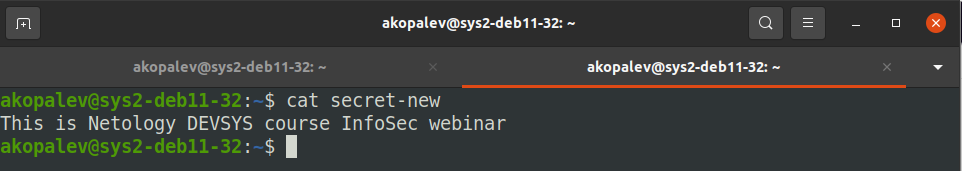

### Задание 1
Теоретически трафик шифруется через TLS, но трафик идет через сервер сторонней компании, поэтому там он может подвергаться различному анализу, поэтому я считаю что передаваемая информация не является полностью защищенной

### Задание 2
Я выберу SSTP протокол, т. к. он работает на 443 порту, как и HTTPS

### Задание 3
Я бы использовал VPN типа точка-сеть, так как необходимо многим пользователям предоставлять доступ к нескольким ресурсам в офисе.

### Задание 4

